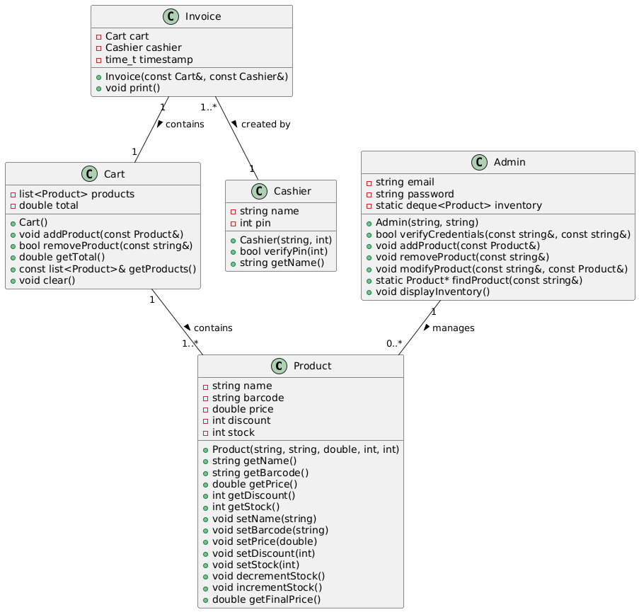
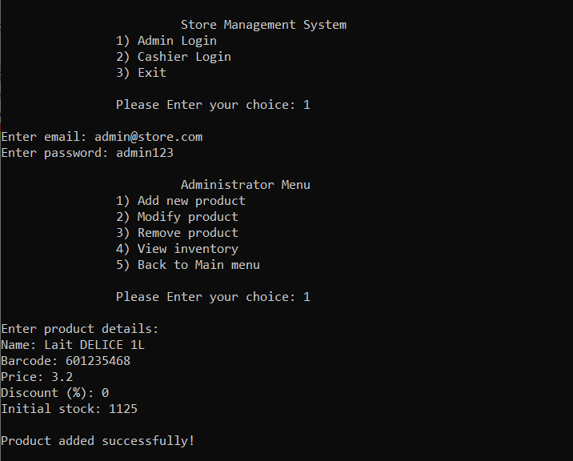
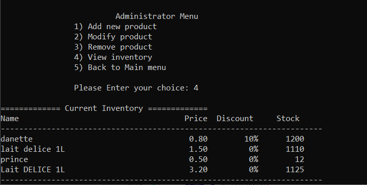
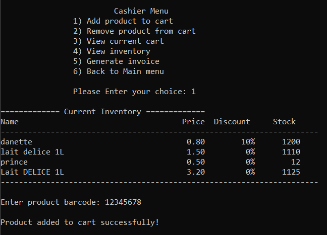
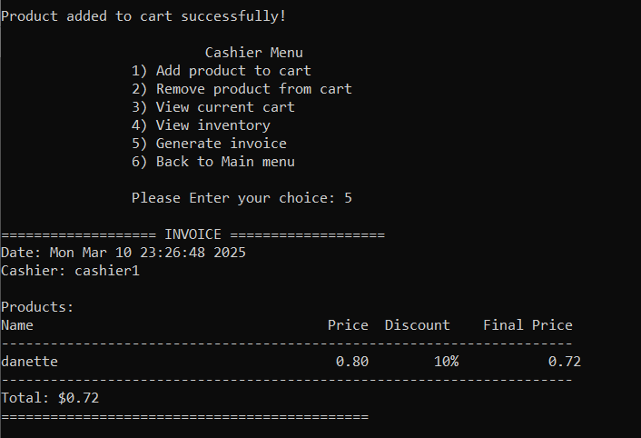

# STORE-MANAGEMENT-SYSTEM
The code provided is a Store Management System implemented in C++. It is designed to manage a store's inventory, handle cashier operations, and generate invoices for purchases.
# Features 
- **Product Management**: Admins can add, modify, and remove products from the inventory.
- **Cart Operations**: Cashiers can add or remove products from a customer's cart and view the current cart status.
- **Invoice Generation**: Generate and print invoices detailing purchased items, discounts, and total amounts.
- **Persistent Storage**: Inventory data is saved to and loaded from a file, ensuring data persistence across sessions.
- **User Interface**: Simple console-based interface for both admin and cashier roles.
# the code is OOP so i have created a class diagram :

# Usage
-Choose between Admin and Cashier login from the main menu. 
-Follow the prompts to manage products or handle customer transactions. 
-Admins can view and modify the inventory, while cashiers can manage customer carts and generate invoices. 
# TRIAL

